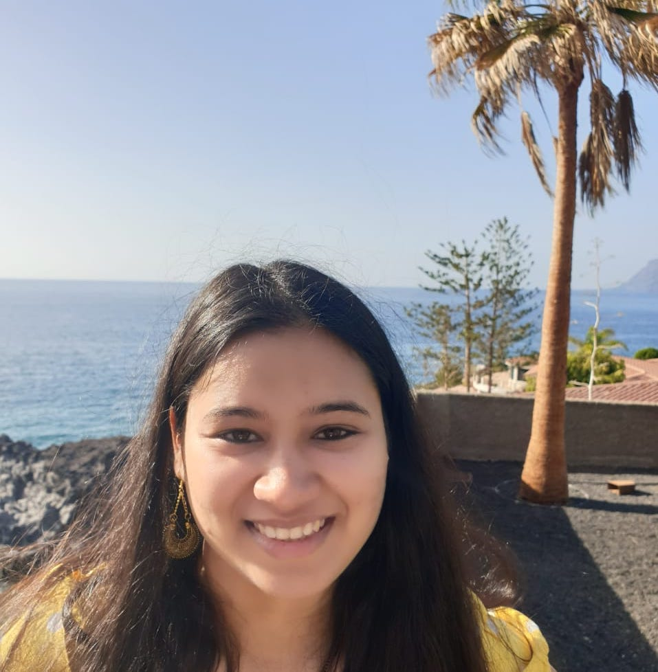

# About 

 I am a Ph.D. candidate in Computer Science at the University of Massachusetts Amherst, advised by <a href="http://brenocon.com/">Brendan O'Connor</a>. I'm a member of the <a href="https://slanglab.cs.umass.edu/">SLANG Lab</a> and the larger <a href="https://nlp.cs.umass.edu/">UMass NLP group</a>. I am grateful to have been supported by an <a href="https://research.ibm.com/university/awards/fellowships-awardees.html">IBM PhD Fellowship Award 2023-2024</a>.

 My research develops computational methods to understand how people use language to reason and communicate in different high-stakes social settings. I focus on understanding complex reasoning patterns and modeling rich semantic structures in <strong>argumentative and narrative texts</strong>, with applications in public policy, law, and healthcare. To this end, I develop new <strong>generative artificial intelligence (AI), machine learning (ML), natural language processing (NLP), and computational social science (CSS) </strong> methods and address key challenges in their use, including reliability, efficiency, and transparency. I also actively collaborate with scholars in linguistics, statistics, public policy, law, and health.

 In the past, I worked with the India Machine Learning team at <a href="https://www.amazon.science/">Amazon</a>, and the Advanced Technology Lab at <a href="https://research.samsung.com/sri-b">Samsung Research</a>. I completed my ME from <a href="https://www.iisc.ac.in/"> Indian Institute of Science</a>, where I was advised by <a href="https://ee.iisc.ac.in/sastry-p-s/">P.S. Sastry</a> and <a href="https://ee.iisc.ac.in/~gurunath/">Gurunath Gurrala</a>.

<strong>I am on the academic job market for positions starting in Fall 2026!</strong> If you think a position would be a good fit, please do reach out. Here are my materials: <a href="https://ankitaiisc.github.io/assets/Ankita_Gupta_Research_Statement.pdf">research statement</a>, <a href="https://ankitaiisc.github.io/assets/Ankita_Gupta_Teaching_Statement.pdf">teaching and mentoring statement</a>.
 

