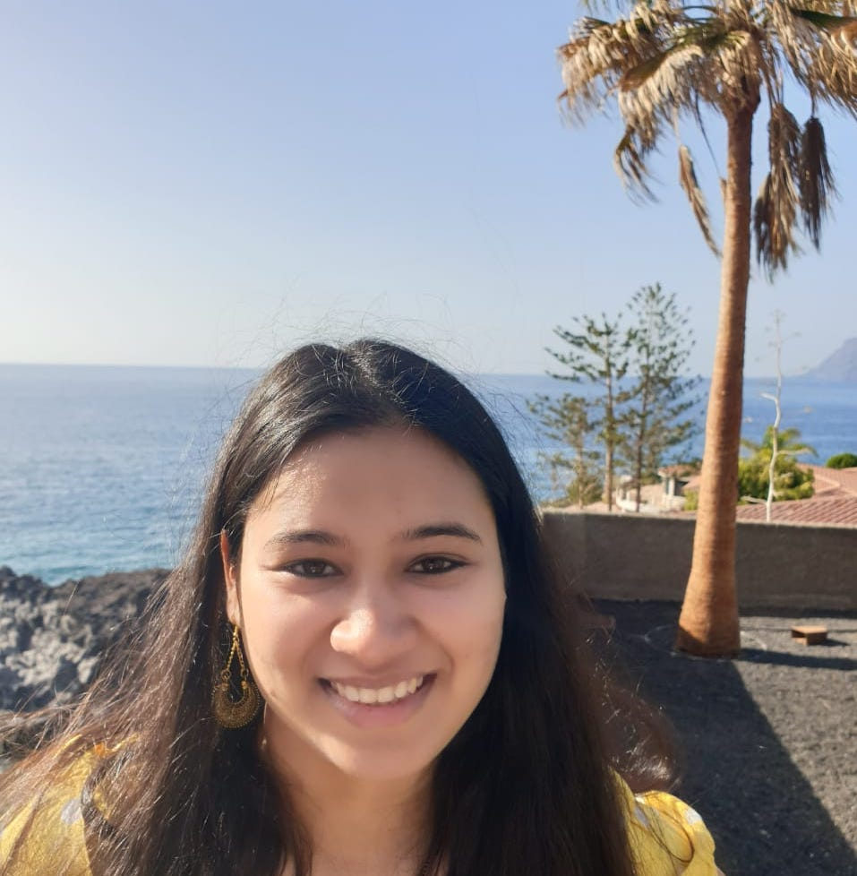

# About 

 I am a <strike>first</strike> second year Ph.D. student in Computer Science at University of Massachusetts Amherst advised by <a href="http://brenocon.com/">Brendan T. O'Connor</a> in the <a href="https://nlp.cs.umass.edu/">UMass NLP Lab</a>. I also work in collaboration with <a href="https://meedan.com/blog/fact-champ-launch/">Fact Champ</a>, an effort to investigate racially targeted misinformation and develop culturally appropriate interventions. I am broadly interested in misinformation detection, learning from crowdsourced/limited data, computational social science and natural language understanding.

 Previosuly, I also worked as an Applied Scientist in India Machine Learning team at <a href="https://www.amazon.science/">Amazon, Bangalore</a>, where I worked on problems such as - contextual bandits for recommendation systems and meta-learning. Earlier, I also worked in Advanced Technology Lab at <a href="https://research.samsung.com/sri-b">Samsung Research, Bangalore</a>. There, I worked on computational methods for detecting and analyzing misinformation on the web. Checkout my work in this area <a href="https://scholar.google.com/citations?user=7nq1kBMAAAAJ&hl=en">here!</a>

 I did my Master's from <a href="https://www.iisc.ac.in/"> Indian Institute of Science, Bangalore </a>, where I was very fortunate to work with <a href="http://www.ee.iisc.ac.in/faculty/sastry/">P. S. Sastry</a> and <a href="http://www.ee.iisc.ac.in/faculty/gurunath/">Gurunath Gurrala</a> on Instability Prediction in Power Systems using deep learning methods.

## Recent News
<table style="width:150%">
  <tr>
    <td>Fall 2022</td>
  	<td>I am co-organizing the <a href="https://umass-mlfl.github.io/">Machine Learning and Friends Lunch</a> at UMass Amherst with Wenlong Zhao and Dmitry Petrov. If you have speaker recommendations, fill them <a href="https://forms.gle/7t8rZzwYepxuShKM8">here</a>!</td>
  </tr>
  <tr>
    <td>May 2022</td>
    <td>Started summer internship at <a href="https://research.ibm.com/teams/natural-language-processing"> IBM Watson </a> in Yorktown Heights, New York</td>
  </tr>
  <tr>
    <td>Oct 2021</td>
    <td>Presented at <a href="https://tada2021.org/"> TADA 2021</a></td>
  </tr>
  <tr>
    <td>July 2021</td>
    <td>Awarded <a href="https://ghc.anitab.org/attend/scholarships/academics/"> Grace Hopper Celebration 2021 Student Scholarship</a></td>
  </tr>
  <tr>
    <td>June 2021</td>
    <td>Awarded <a href="https://www.cics.umass.edu/support"> Anuradha and Hanuma Kodavalla Graduate Scholarship in Computer Science</a></td>
  </tr>
  <tr>
    <td>May 2021</td>
    <td>Awarded <a href="https://www.cics.umass.edu/support"> W. Bruce Croft Graduate Scholarship in Computer Science</a></td>
  </tr>
  <tr>
    <td>Jan  2021</td>
    <td>Started my Ph.D. in Computer Science at <a href="https://www.umass.edu/">UMass Amherst</a></td>
  </tr>
</table>

